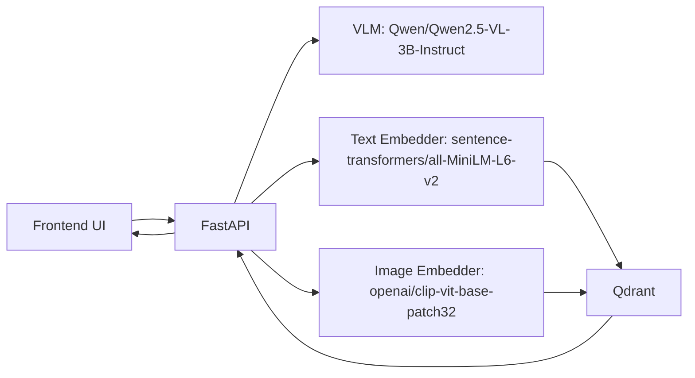
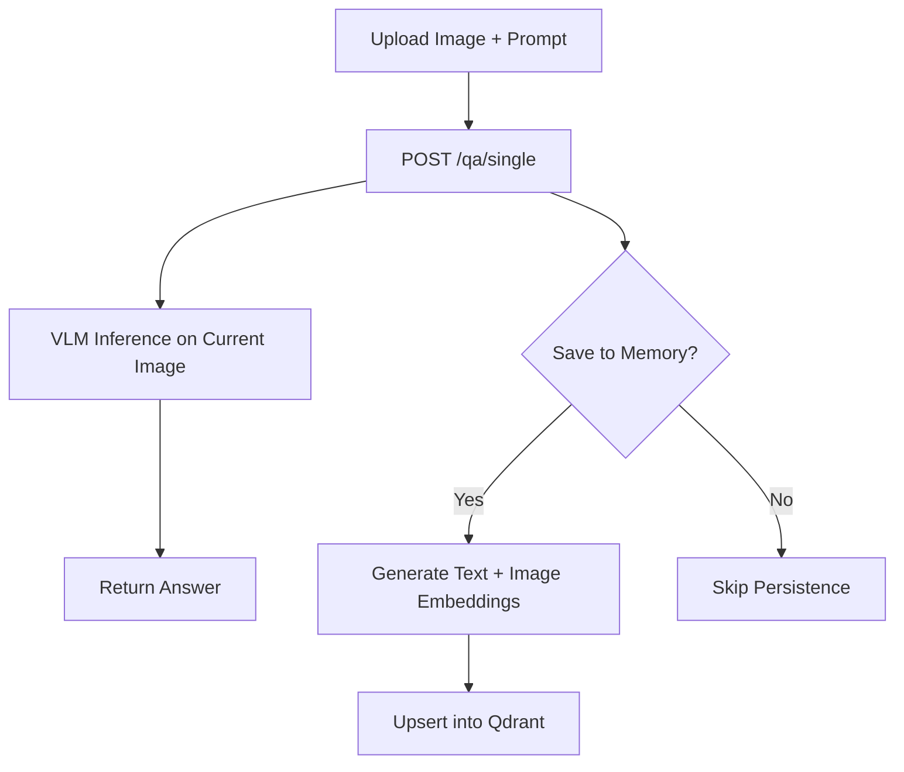
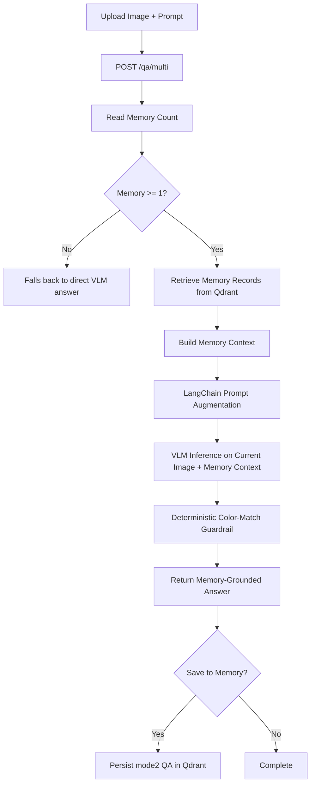

# MKRS (Multimodal Knowledge Retrieval System)

MKRS is a multimodal AI application for image-based question answering with optional persistent memory.

It combines:

- A vision-language model (VLM) for reasoning over uploaded images.
- A vector database (Qdrant) for storing memory as multimodal embeddings.
- A retrieval-augmented mode that uses stored context for cross-image reasoning.

MKRS currently supports two operational modes:

- Mode 1 (`single_qa`): stateless reasoning on one current image (with optional save-to-memory).
- Mode 2 (`multi_qa`): memory-aware reasoning that uses records already stored in Qdrant.

---

## What MKRS Solves

MKRS is designed for scenarios where a user wants:

- Immediate visual QA on a newly uploaded image.
- Optional persistence of question-answer context for future reuse.
- Follow-up questions that depend on both the current image and historical memory records.

In practical terms:

- Mode 1 handles direct single-image understanding, including OCR and non-OCR prompts.
- Mode 2 handles collection-aware reasoning by grounding generation in stored memory context.

---

## Feature Summary

### Mode 1: Single Image QA (Stateless + Optional Memory Save)

- Accepts an uploaded image and question.
- Runs VLM inference on the current image only.
- Returns an answer immediately.
- If `Save to Memory` is enabled, stores:
  - `question`
  - `answer`
  - `filename`
  - `mode`
  - text embedding (`384-dim`)
  - image embedding (`512-dim`)

### Mode 2: Multi Image QA (RAG over Stored Collection)

- Activated when memory records exist (`memory_count >= 1`).
- Retrieves memory context from Qdrant and builds an augmented prompt.
- Uses LangChain prompt templates to structure memory-grounded instructions.
- Includes deterministic post-processing for collection color-match questions.

Mode 2 phrasing for your project:

> Mode 2 is a domain-specialized, memory-grounded RAG pipeline optimized for accurate fruit-color reasoning across the stored image collection.

This means Mode 2 is currently tuned for prompts like:

- “Is there another fruit in the collection with the same color?”
- “Which prior fruit matches the current fruit color?”

---

## High-Level Architecture



---

## Mode Flows

### Mode 1 Flow (`/qa/single`)



### Mode 2 Flow (`/qa/multi`)



---

## Routing Policy in Current UI

The frontend follows this policy:

- If `memory_count == 0` -> route to `/qa/single`.
- If `memory_count >= 1` -> route to `/qa/multi`.
- `Save to Memory` controls persistence behavior, not mode selection once memory exists.

Expected logging behavior:

- `memory_count == 0`, save checked -> `single_qa` logs with `Save to Memory: True`.
- `memory_count == 0`, save unchecked -> `single_qa` logs with `Save to Memory: False`.
- `memory_count >= 1`, save checked -> `multi_qa` logs with `Save to Memory: True` and memory record count.
- `memory_count >= 1`, save unchecked -> `multi_qa` logs with `Save to Memory: False` and memory record count.

---

## Tooling, Purpose, and Versions

Versions are based on this repository’s pinned dependencies (`requirements.txt`) and Docker config.

| Tool                  | Version                  | Purpose in MKRS                                             |
| --------------------- | ------------------------ | ----------------------------------------------------------- |
| Python                | 3.11+ (recommended)      | Runtime for FastAPI app and model stack                     |
| FastAPI               | `0.125.0`              | API framework for `/qa/*` and `/memory/*` endpoints     |
| Uvicorn               | `0.38.0`               | ASGI server for local development/runtime                   |
| Qdrant Client         | `1.16.2`               | Python SDK for creating collections, upsert, search, scroll |
| Qdrant Server         | `qdrant/qdrant:latest` | Self-hosted vector database for multimodal memory           |
| LangChain             | `1.2.10`               | Prompt orchestration for Mode 2 RAG flow                    |
| LangChain Core        | `1.2.17`               | Core prompt primitives (`ChatPromptTemplate`)             |
| Transformers          | `4.57.3`               | VLM and model inference pipeline                            |
| Torch                 | `2.9.1+cu128`          | Tensor compute backend (GPU/CPU)                            |
| Sentence Transformers | `5.2.0`                | Text embedding model execution                              |
| Pillow                | `12.0.0`               | Image loading and preprocessing                             |
| Docker Engine         | Host-installed           | Container runtime for Qdrant                                |
| Docker Compose spec   | `3.8`                  | Service definition in `docker/qdrant.yaml`                |

Notes:

- Qdrant is currently configured with `latest`, which is a floating tag.
- For reproducibility in production, pin to a fixed Qdrant version tag.

---

## Project Structure

```text
app/
  api/
    single_qa.py        # Mode 1 endpoint
    multi_qa.py         # Mode 2 endpoint (RAG + guardrail)
    memory.py           # Memory count/clear endpoints
  models/
    vision_llm.py       # VLM loading + inference
    text_embedder.py    # Text embeddings
    image_embedder.py   # Image embeddings
  storage/
    qdrant_store.py     # Qdrant collection, upsert, retrieval
  core/
    config.py           # Settings and dimensions
frontend/
  index.html            # UI
  app.js                # Mode routing + API calls
docker/
  qdrant.yaml           # Qdrant container definition
```

---

## Setup and Run

## 1) Clone and Install Dependencies

```bash
git clone <your-repo-url>
cd mkrs-optional-memory
pip install -r requirements.txt
```

## 2) Start Qdrant with Docker

Option A: Use provided compose file.

```bash
docker compose -f docker/qdrant.yaml up -d
```

Option B: Manual image/container commands.

```bash
docker pull qdrant/qdrant:latest
docker volume create qdrant_data
docker run -d \
  --name mkrs-qdrant \
  -p 6333:6333 \
  -p 6334:6334 \
  -v qdrant_data:/qdrant/storage \
  --restart unless-stopped \
  qdrant/qdrant:latest
```

## 3) Verify Qdrant

- API: `http://localhost:6333`
- Dashboard: `http://localhost:6333/dashboard`

You should see collection `mkrs_memory` after first app interaction (or collection initialization).

## 4) Run MKRS App

```bash
uvicorn app.main:app --reload
```

## 5) Open UI / API Docs

- UI: `http://localhost:8000/`
- Swagger docs: `http://localhost:8000/docs`

---

## Usage Walkthrough

### Mode 1 Example

1. Ensure memory is empty (`Memory: 0`).
2. Upload one image.
3. Ask a question.
4. Toggle `Save to Memory` as needed.
5. Observe:
   - Stateless answer from current image.
   - Optional persistence into Qdrant.

Mode 1 supports OCR and non-OCR use cases, because the VLM reasons directly over visible content and scene semantics in the single uploaded image.

### Mode 2 Example

1. Create memory by saving one or more prior QA results.
2. Upload a new image and ask a collection-based question.
3. MKRS retrieves memory records and builds a RAG prompt.
4. For fruit color-comparison prompts, Mode 2 uses specialized enforcement to improve answer consistency.

---

## API Endpoints

| Endpoint          | Method   | Purpose                               |
| ----------------- | -------- | ------------------------------------- |
| `/qa/single`    | `POST` | Mode 1 single-image QA                |
| `/qa/multi`     | `POST` | Mode 2 memory-grounded QA             |
| `/memory/count` | `GET`  | Return number of points in Qdrant     |
| `/memory/clear` | `POST` | Delete and recreate memory collection |
| `/health`       | `GET`  | Service health status                 |

---

## Configuration

Key settings from `app/core/config.py`:

- `MODEL_NAME=Qwen/Qwen2.5-VL-3B-Instruct`
- `QDRANT_URL=http://localhost:6333`
- `QDRANT_COLLECTION=mkrs_memory`
- `TEXT_EMBEDDING_DIM=384`
- `IMAGE_EMBEDDING_DIM=512`
- `TEXT_VECTOR_NAME=text`
- `IMAGE_VECTOR_NAME=image`
- `RAG_TOP_K=5` (overridable via environment variable)

---

## Current Scope and Limitations

- Mode 2 is intentionally specialized for fruit-color comparison questions.
- Memory extraction logic relies on patterns present in stored QA text.
- Qdrant image tag is currently floating (`latest`), which may change behavior over time.

---

## License

This repository is licensed under the [MIT License](LICENSE.md).
